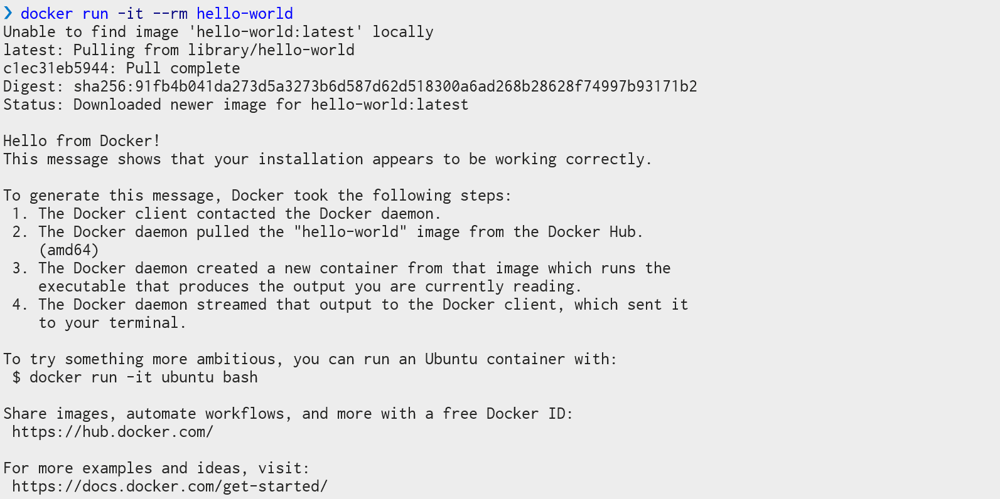
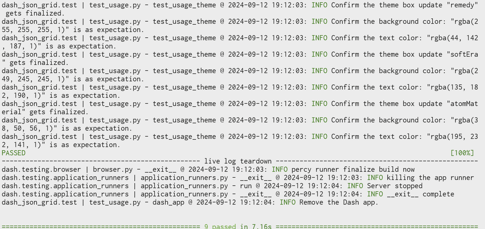
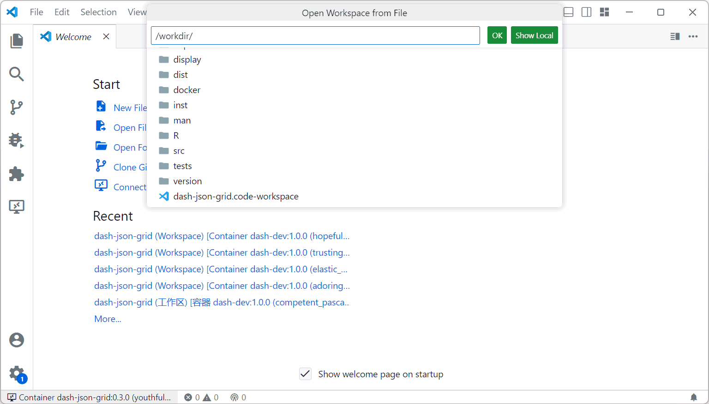

# Dash JSON Grid

## CONTRIBUTING

This guide shows how to compile and test this project. Anyone who want to contribute to these codes can follow this guide and submit the pull request. [Section 2 :bookmark:](#2-work-with-docker) and [Section 3 :bookmark:](#3-work-with-conda) suggests how to work with Docker or Conda, respectively. Please choose either of these tools to deploy the environment and develop this project.

> [!CAUTION]
> We strongly suggest users to prepare the environment by Docker (see [2.1. :bookmark:](#21-install-by-docker)).
> Docker is supported by both Linux and Windows. Using Docker can save a lot of steps and mitigate issues caused by the path.

### 1. Explanations for the source codes

* Review our [code of conduct :memo:](./CODE_OF_CONDUCT.md) before contributing to this project.

* The metadata of the project is defined in `pyproject.toml` and `package.json`. Modifying `package.json` will not automatically update `pyproject.toml`. Therefore, users need to ensure changes for both files if any part of the metadata needs to be changed.

* The React source files are in the `src/lib/` folder. These codes are formatted by [`pretteir`:hammer:][tool-prettier].

* The Python codes are in the package `dash_json_grid/` folder. These codes are formatted by [`black`:hammer:][tool-black]. Note that the automatically generated files like `_imports_.py` and `DashJsonGrid.py` will not be formatted.

* The React demo app is in `src/demo/`. It does not influence the Dash component because it is purely written by React.

* The Dash demo app is `usage.py`. It shows an example of rending the JSON grid viewer and interact with it. Clicking a number on the table will let that value increase by 1.

* The unit tests are defined in the `tests/` folder.

* The `version/` folder is only used for helping `pyproject.toml` fetch the current version.

* The tool configurations for `pytest`, `black`, and `pyright` are defined in `pyproject.toml`. However, the configurations for `flake8`, `pylint`, and `prettier` are still kept in their corresponding configurations files.

* If any custom styles are defined but not imported as a part of the react codes, please add these custom CSS files into the distribution folder (`dash_json_grid`).
    * Make sure that they are referenced in `MANIFEST.in` so that they get properly included when you're ready to publish your component.
    * Make sure the stylesheets are added to the `_css_dist` dict in `dash_json_grid/__init__.py` so dash will serve them automatically when the component suite is requested.

* Remember to use [`black`:hammer:][tool-black] and [`pretteir`:hammer:][tool-prettier] to format any modified Python and React codes, respectively. [Review your code :memo:](./review_checklist.md) before sending the pull request.

### 2. Work with Docker

#### 2.1. Install by Docker

If you choose to use Docker. The only software you need to install is `docker` itself. Check the following guide to install Docker on your device:

https://docs.docker.com/get-started/get-docker/

After installing docker, test whether it works or not by

``` sh
docker run -it --rm hello-world
```

You should be able to see the message like this, which shows that `docker` is working well:



Then, build the docker image by

``` sh
docker build -t dash-json-grid:latest https://github.com/cainmagi/dash-json-grid.git
```

This step may take a little bit long. After successfully building the image, you can start working on this project.

#### 2.2. Test the codes

Run the following command to start the tests.

``` sh
docker run -it --rm dash-json-grid:latest --with-dash
```

If the codes have not been modified, you suppose to see the the messages like this:



It shows that all unit tests get passed.

#### 2.3. Run the demo

We have prepared a pure `React` demo and a `Dash` demo, respectively. Run this command to launch the react demo:

``` sh
docker run -it --rm -p 8080:8080 dash-json-grid:latest --react
```

Or run the following command to launch the dash demo:

``` sh
docker run -it --rm -p 8080:8080 dash-json-grid:latest --demo
```

When the demo is running, you should be able to access the demo by

http://localhost:8080/

#### 2.4. Run more examples

We provide some extra examples in the [examples folder :link:](https://github.com/cainmagi/dash-json-grid/tree/main/examples).
To run these examples with the docker image, use the following command:

``` sh
docker run -it --rm -p 8080:8080 dash-json-grid:latest --demo demo=editor
```

where `demo=` specifies the name of the example script. The postfix `.py` should not be included.

Currently, the available examples are:

|                                       `demo=`                                       | Description                                            |
| :---------------------------------------------------------------------------------: | :----------------------------------------------------- |
| [`editor`](https://github.com/cainmagi/dash-json-grid/blob/main/examples/editor.py) | A demo for making a JSON editor with `dash-json-grid`. |

#### 2.5. Develop the project

To modify the scripts, you may want to clone an Git repository by yourself:

``` sh
git clone https://github.com/cainmagi/dash-json-grid
```

Then, you can run the docker container and mount the newly cloned Git folder to the container:

``` sh
docker run -it --rm -v <path-to-the-project>:/workdir -p 8080:8080 dash-json-grid:latest --bash
```

When the container is running, you should be able to see that your are in the container's console.

Please leave the container open, and follow this guide to **attach your vscode to the running container**:

https://code.visualstudio.com/docs/devcontainers/attach-container



At the **bottom left** corner, you should be able to see the name of the current container. When you open a new workspace, you should be able to find the the project in `/workdir`.

Now you will be able to start the development. You can do the following things to test the codes.

* Build the component

    ``` sh
    yarn install
    yarn build
    ```

* Run the `pytest`:

    ``` sh
    python -m pytest --headless --with-dash
    ```

* Run the demo:

    ``` sh
    python usage.py
    ```

* Run a different demo:

    ``` sh
    python examples/editor.py
    ```

* Run the React demo
  
    ``` sh
    yarn start
    ```

* Format the python codes
  
    ``` sh
    black .
    ```

* Build the python pacakge
  
    ``` sh
    python -m build
    ```

Before submitting a pull request, please ensure that all unit tests (`pytest`) get passed and the codes are formatted by `black`.

### 3. Work with Conda

> [!CAUTION]
> This method is not recommended because `conda` may take redundant space to install unnecessary pacakges. Users need to maintain the dependencies by themselves.

Before start the installation, you need to ensure the following things are installed:

* Conda or Mamba
  
    Either MiniConda or MicroMamba is a good option. MicroMamba is even faster than MiniConda. If you choose to use micromamba, you simply need to replace `conda` by `micromamba` in any command.

    * Get MiniConda: https://docs.anaconda.com/miniconda/miniconda-install/
    * Get MicroMamba: https://mamba.readthedocs.io/en/latest/installation/micromamba-installation.html

* A browser

    You need to ensure that either one of the Chromium-based browser is installed.

    * Get Edge: https://www.microsoft.com/en-us/edge/download
    * Get Chrome: https://www.google.com/chrome/dr/download
    * Get Chromium: https://www.chromium.org/getting-involved/download-chromium/

* Git

    You need to ensure that Git command is available:

    * Get Git: https://git-scm.com/downloads

#### 3.1. Get the source codes

Use Git to clone the latest source codes:

``` sh
git clone https://github.com/cainmagi/dash-json-grid
```

#### 3.2. Prepare the dependencies

The following steps will help you configure the environment with `conda`:

1. Create the environment

    ``` sh
    conda create -c conda-forge -n dashdev-djg python=3.12 wheel setuptools nodejs yarn
    ```

2. Enter the environment

    ``` sh
    conda activate dashdev-djg
    ```

3. Install the Python dependencies

    ``` sh
    pip install -r requirements-dev.txt -r tests/requirements.txt -r examples/requirements.txt
    ```

4. Install the Node.js dependencies and build the first version.

    ``` sh
    yarn install
    yarn build
    ```

#### 3.3. Run the test

To verify whether you have correctly prepared the environment or not, you can run the following command:

``` sh
python -m pytest --headless --with-dash
```

#### 3.4. Develop the project

You can do the following things to test the codes.

* Build the component

    ``` sh
    yarn install
    yarn build
    ```

* Run the `pytest`:

    ``` sh
    python -m pytest --headless --with-dash
    ```

* Run the demo:

    ``` sh
    python usage.py
    ```

* Run a different demo:

    ``` sh
    python examples/editor.py
    ```

* Run the React demo
  
    ``` sh
    yarn start
    ```

* Format the python codes
  
    ``` sh
    black .
    ```

* Build the python pacakge
  
    ``` sh
    python -m build
    ```

Before submitting a pull request, please ensure that all unit tests (`pytest`) get passed and the codes are formatted by `black`.

[tool-black]:https://marketplace.visualstudio.com/items?itemName=ms-python.black-formatter
[tool-prettier]:https://marketplace.visualstudio.com/items?itemName=ms-python.black-formatter
